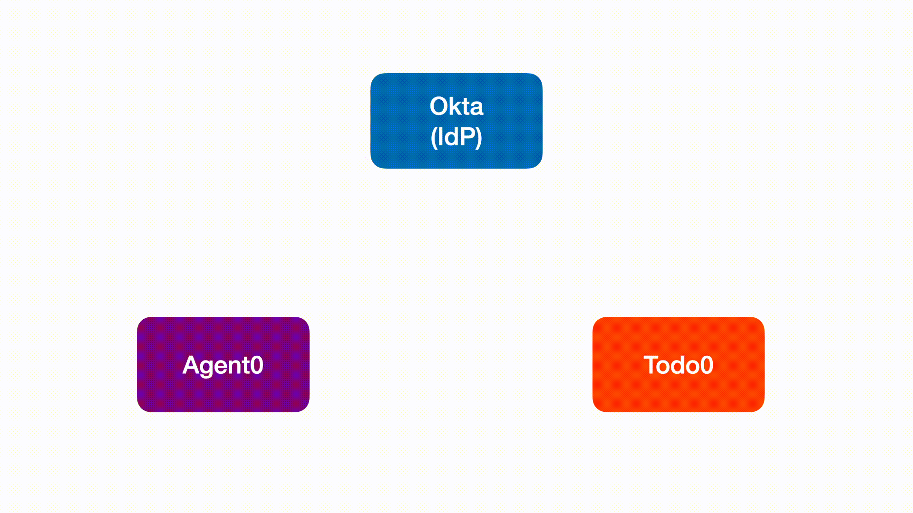

> ⚠️ **Important:**
> To run this Cross-App Access MCP demo app, you'll need an Okta Preview account. If you don't already have one, or if you're interested in testing Cross-App Access with Okta as your Identity Provider (IdP), please [sign up for our early access offering](https://www.okta.com/saas-security/sign-up/?_gl=1*pp31c*_gcl_au*NjgzNDkyOTQxLjE3NTA4Nzg2Njk.*_ga*MTk5NjYyODgxMi4xNzUwMjg1MDM3*_ga_QKMSDV5369*czE3NTEyOTY4OTYkbzgkZzEkdDE3NTEyOTg0MjEkajM5JGwwJGgw).

[](https://nodejs.org/)
[](LICENSE)
[](https://snyk.io/test/github/oktadev/okta-cross-app-access-mcp)
[](https://prettier.io/)
[](https://github.com/oktadev/okta-cross-app-access-mcp/commits/main)

# Okta Cross App Access MCP - Node Example

A proof-of-concept demonstrating how a Model Context Protocol (MCP) can leverage the [Identity Assertion Authorization Grant](https://datatracker.ietf.org/doc/html/draft-parecki-oauth-identity-assertion-authz-grant) specification to enable secure and interoperable authorization of MCP clients within enterprise environments, using existing identity infrastructure.



# Table of Contents

- [Quickstart & Dev Setup](#quickstart--dev-setup)
- [Common Issues](#common-issues)
- [Troubleshooting](#troubleshooting)
- [Dev Tips](#dev-tips)

# Quickstart & Dev Setup

**Highly Recommended:**

- **Run in GitHub Codespaces**
  - Click "Code" → "Create a codespace on main" in the GitHub UI and your environment will be ready in minutes.
  - Or, launch instantly:

    [](https://github.com/codespaces/new?repo=oktadev/okta-cross-app-access-mcp)

- **Run Locally in VS Code (Alternative):**
  - [Docker Desktop](https://www.docker.com/products/docker-desktop/) (required for local containers)
  - [VS Code](https://code.visualstudio.com/) (required for Dev Containers)
  - [Dev Containers VSCode Extension](https://marketplace.visualstudio.com/items?itemName=ms-vscode-remote.remote-containers)

## 1. Clone and Open in VS Code

> **Note:** If you are using GitHub Codespaces, you can skip this step as the repository will be automatically cloned for you.

```sh
git clone https://github.com/oktadev/okta-cross-app-access-mcp.git
cd okta-cross-app-access-mcp
```

- Open VS Code Command Palette and run "Dev Containers: Open Folder in Container". To open Command Palette, select **View** → **Command Palette...**, MacOS keyboard shortcut `Cmd+Shift+P`, or Windows keyboard shortcut `Ctrl+Shift+P`.

## 2. Configure Environment

```sh
yarn setup:env
```

> **Note:** The `yarn setup:env` command copies template `.env.default` files to `.env` so you can fill in your credentials.

Edit the following files to fill in required values:

- `packages/authorization-server/.env.todo`
- `packages/agent0/.env`

**Required fields:**

| File                                       | Variable Name             | Values                                |
| ------------------------------------------ | ------------------------- | ------------------------------------- |
| `packages/authorization-server/.env.todo`  | `CUSTOMER1_EMAIL_DOMAIN`  | `tables.fake`                         |
|                                            | `CUSTOMER1_AUTH_ISSUER`   | `https://{orgDomain}.oktapreview.com` |
|                                            | `CUSTOMER1_CLIENT_ID`     | `<OIDC client id at IdP>`             |
|                                            | `CUSTOMER1_CLIENT_SECRET` | `<OIDC client secret at IdP>`         |
| `packages/authorization-server/.env.agent` | `CUSTOMER1_EMAIL_DOMAIN`  | `tables.fake`                         |
|                                            | `CUSTOMER1_AUTH_ISSUER`   | `https://{orgDomain}.oktapreview.com` |
|                                            | `CUSTOMER1_CLIENT_ID`     | `<OIDC client id at IdP>`             |
|                                            | `CUSTOMER1_CLIENT_SECRET` | `<OIDC client secret at IdP>`         |
| `packages/agent0/.env`                     | `AWS_ACCESS_KEY_ID`       | `<your AWS access key id>`            |
|                                            | `AWS_SECRET_ACCESS_KEY`   | `<your AWS secret access key>`        |

> **How to retrieve these values:**
>
> - These values are provided by your Identity Provider (IdP) when you register your OIDC application.
> - For AWS credentials, to know how to generate AWS Credentials - [Follow this steps](guide/aws-bedrock.md)
> - Typically, you can find IdP values in your IdP's admin console or developer portal under the application/client settings.
> - For example, in Okta, Azure AD, Auth0, or similar providers, look for the "Issuer URL" and "Client ID" fields.
> - If unsure, consult your IdP or AWS documentation or administrator for guidance.

## 3. Install Dependencies & Seed the Database

```sh
yarn bootstrap
```

> **Note:**
> The `yarn bootstrap` command will also run `yarn resetdb` to initialize your databases. During this process, you’ll see a prompt:
>
> `Are you sure you want to reset your database? All data will be lost.`
>
> - Type `y` and press Enter to reset and re-seed the databases.
> - This is required the first time you run the project, or whenever you want to start with clean test data.

## 4. Start All Services

You can start all backend and frontend services in parallel using one of the following commands:

```sh
yarn start
```

> - This command launches all backend and frontend services in parallel, each on its own port, so you can develop and test the full system at once.
> - If you prefer, you can manually open 4 terminals and run the following commands individually for more control:
>   - `yarn dev:agent0`
>   - `yarn auth:agent0`
>   - `yarn dev:todo0`
>   - `yarn auth:todo0`

## Open the Application UIs

To access the application interfaces, open your browser and navigate to:

- [http://localhost:3001/](http://localhost:3001/) (Todo0)
- [http://localhost:3000/](http://localhost:3000/) (Agent0)

## 5. Verify Your Setup

<a href="https://youtu.be/vi5JpbGRATE?t=1415">
  
</a>


### What to do if a test fails

- If an operation does not work as expected (e.g., you cannot log in, create, or edit items), check the terminal output for errors.
- Common issues include misconfigured `.env` files, missing database migrations, or services not running.
- Review the "Common Issues" and "Troubleshooting" sections above for guidance.

# Common Issues

- **App not starting?** Ensure all `.env` files are present and filled in.
- **Database errors?** Try `yarn resetdb` to re-seed the database.
- **Ports in use?** Make sure no other apps are running on ports `3000`, `3001`, `5000`, or `5001`.

# Troubleshooting

If you have any trouble, try re-authenticating to both applications by signing out and signing in again.

# Dev Tips

**Access the mysql database directly with the following:**

```
mariadb -u root --password=avocado -P 3306
```

**Run the following after making schema changes to a schema.prisma file**

Make sure to replace the content in `<>`.

```
export AGENT_DATABASE_URL=<DB_URL>
export TODO_DATABASE_URL=<DB_URL>
```
